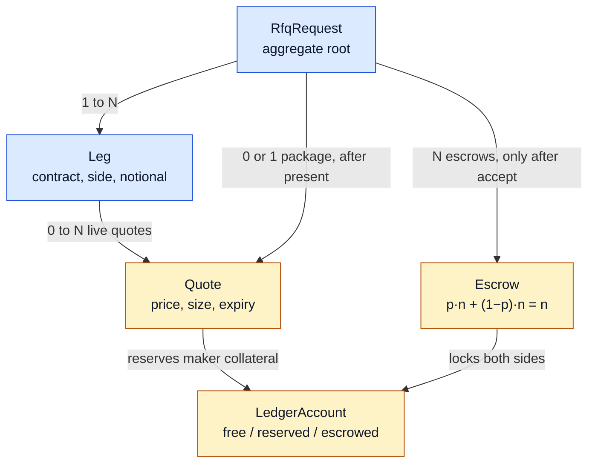
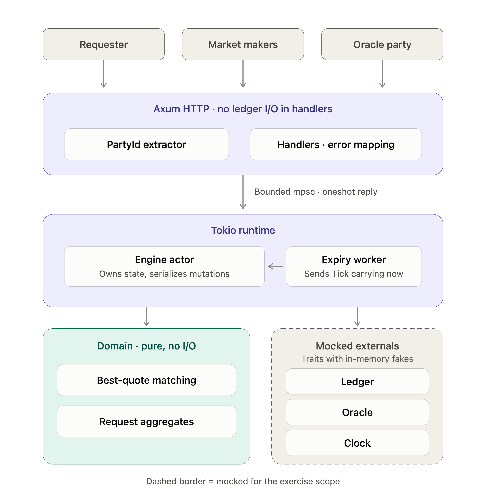
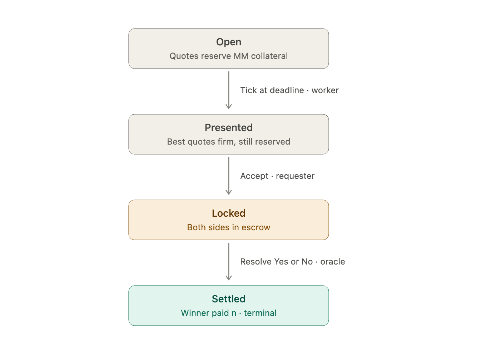
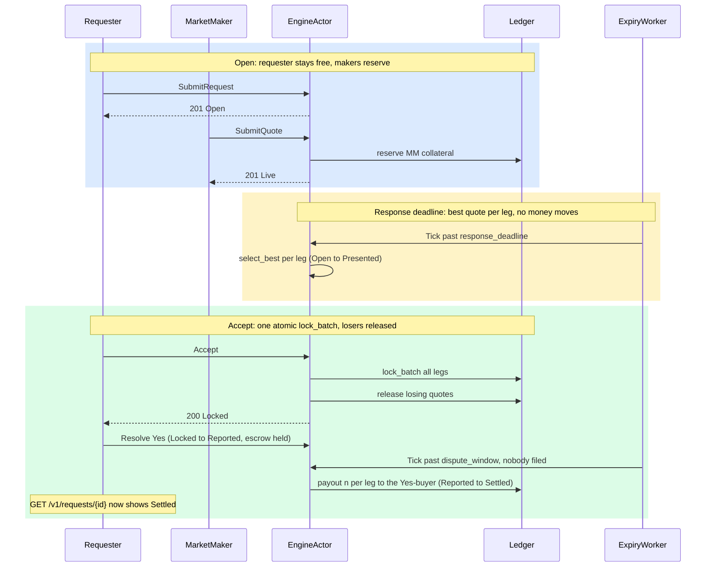
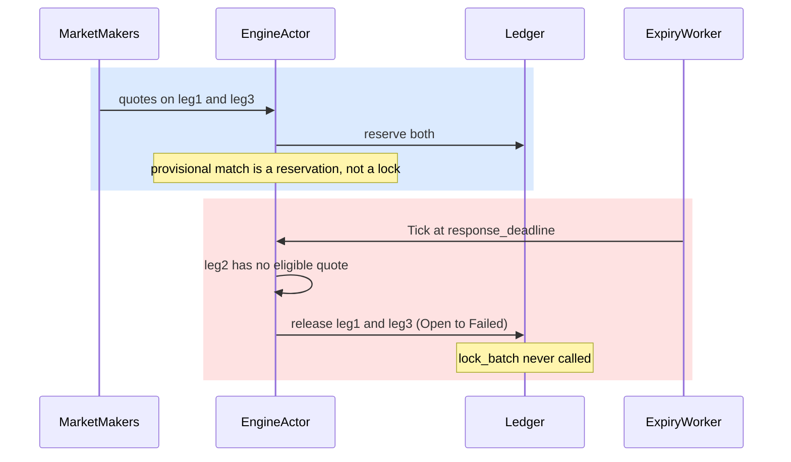
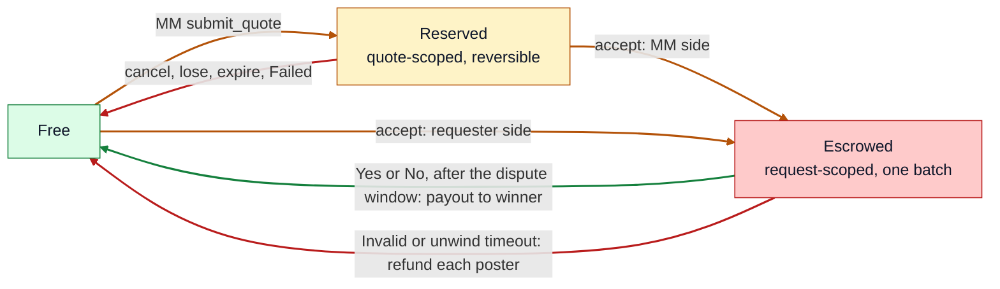
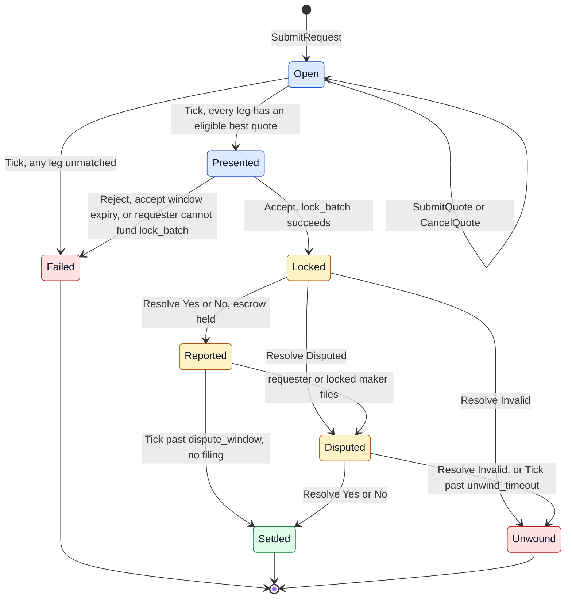

# Permissionless RFQ matching and settlement

A requester publishes a quote request (legs, deadline). Market makers answer with firm, collateralized quotes. At the response deadline the venue selects the best quote per leg and presents a package; the requester accepts or rejects it; on accept both sides lock into escrow in one batch; an oracle outcome that survives the dispute window pays the winner.

Pricing is not this system's problem. Capital is: every intermediate state holds money and every participant is adversarial. Chain and payments are mocked; the oracle is whoever calls the resolve endpoint. The venue is Tokio + Axum; handlers never move funds, they send commands to one engine actor.

## Domain objects

- **Leg**: one binary contract (an opaque id and a description that must be a complete resolution rule, see `ASSUMPTIONS.md`), the requester's side, a notional. Buying No at `1 - p` is selling Yes at `p`, so prices, collateral, and escrow are always in Yes terms: `buy_yes` / `sell_no` make the requester the Yes-buyer, `sell_yes` / `buy_no` make the maker the Yes-buyer.
- **Quote**: maker price, size, expiry. Reserves maker collateral while `Live` or `Selected`.
- **Escrow**: exists only after accept. Yes-buyer locked `p * n`, Yes-seller `(1 - p) * n`, total `n`.

Not a CLOB: no order book, no order types, no partial fills. Fill is atomic per request.

## Components

The engine actor owns all requests and applies commands one at a time, so accept, cancel, and expiry cannot interleave. Matching is pure: eligible quotes are `Live`, `size >= notional`, unexpired, and `expires_at >= accept_deadline`; long-Yes legs take the lowest Yes price, short-Yes legs the highest; ties break on engine submit order.

### Time: the expiry worker and `Tick`

`Tick` is the engine's heartbeat, not a price tick. The expiry worker (`src/worker.rs`) wakes every 500 ms, reads the clock, and sends `Command::Tick { now }` to the actor like any other command; in tests the worker is not started and the harness sends ticks with a chosen `now`, which is what makes every timing race reproducible. The engine never reads a clock inside a tick: deadlines are absolute, so a tick is only "compare every stored deadline against this instant". Per state (`src/engine/tick.rs`):

| State | On a tick with `now` past the deadline |
|---|---|
| Open | release quotes past their own expiry; at `response_deadline`, present a package or fail the request |
| Presented | past `accept_deadline`, fail and release every reservation |
| Reported | past `dispute_deadline` with no filing, pay out the reported outcome |
| Disputed | past `unwind_deadline` with no adjudication, refund every poster |
| Locked, terminal | nothing; `Locked` has no timer (see `docs/RESOLUTION.md`, "Delayed") |

The tick never observes prices or decides outcomes. `resolves_at` says when an outcome is due, and the tick uses it only to cap the accept window; the outcome itself arrives solely through the resolve endpoint. Because a tick is a command on the same single actor, it can never interleave with an accept or a cancel.

### HTTP surface

Identity is the `x-party-id` header. Authorization: accept or reject only your own request, cancel only your own live quote, dispute only a request you are the requester of or locked into as a maker. A request names a `tenor` preset; every leg resolves at `response_deadline + tenor`, and the accept window never extends past that instant.

- `POST /v1/ledger/credit` (mock faucet), `GET /v1/ledger/{party_id}`
- `POST /v1/requests`, `GET /v1/requests/{id}`
- `POST /v1/requests/{id}/quotes`, `DELETE /v1/quotes/{id}`
- `POST /v1/requests/{id}/accept`, `POST /v1/requests/{id}/reject`, `POST /v1/requests/{id}/dispute`
- `POST /v1/oracle/resolve`

## Happy path

The same path with the ledger calls at each step:

## Multi-leg abort: leg 2 of 3 unmatched

A provisional match is a reservation, not a lock. Escrow is request-atomic: there is no half-locked state.

## Money flow

Two buckets, never mixed: **reserved** is reversible and quote-scoped, posted at submit; **escrowed** is request-scoped, created only on accept, all legs in one `lock_batch`.

- **Open**: requester stays free (price unknown). Every live quote has maker collateral reserved.
- **Presented**: selected quotes are firm (no cancel). Unselected quotes stay reserved until accept, reject, or window expiry so the same collateral cannot be spent into another RFQ meanwhile.
- **Locked**: selected reservations plus the requester's free balance move to escrow in one batch, or nothing moves. Losers are released.
- **Reported / Disputed**: escrow unchanged; a timer or an adjudication decides which way it goes.
- **Settled**: escrow pays `n` per leg to the winner. **Unwound / Failed**: every hold returns to its poster.

Conservation: per party, `free + reserved + escrowed` equals credits minus paid out plus received. Venue-wide, escrowed equals the notionals of `Locked`, `Reported`, and `Disputed` requests. The tests assert both after every scenario.

## Request state machine

`Settled`, `Unwound`, and `Failed` are terminal: any further accept, reject, resolve, or dispute is `409`. `Locked` has no timer; `Reported` and `Disputed` do. See `docs/RESOLUTION.md`.

### Quote lifecycle

`Live` leaves for `Released` on cancel, own expiry while the request is `Open`, losing at accept, or the request failing. `Selected` leaves for `Released` on reject, accept-window expiry, or a refused `lock_batch`. A quote's own expiry is not honoured once the request is `Presented`.

## Quote lifetime: seconds vs days

Invariant to that choice: the state machines and who may trigger each transition, reservation versus escrow, best-quote comparison, binary payoff math, and request-atomic `lock_batch`.

Not invariant: how `Tick` is scheduled (an in-process interval today; a durable job for day-long windows), whether quotes are firm at submit or indicative-then-firm (reserving collateral for days is expensive, so a `ConfirmQuote` step before `Presented` would appear), and clock-skew tolerance.

Deadlines are absolute timestamps and `Tick` carries `now`, so seconds-to-days is data and worker period, not a rewrite of `Locked` or `Settled`.
