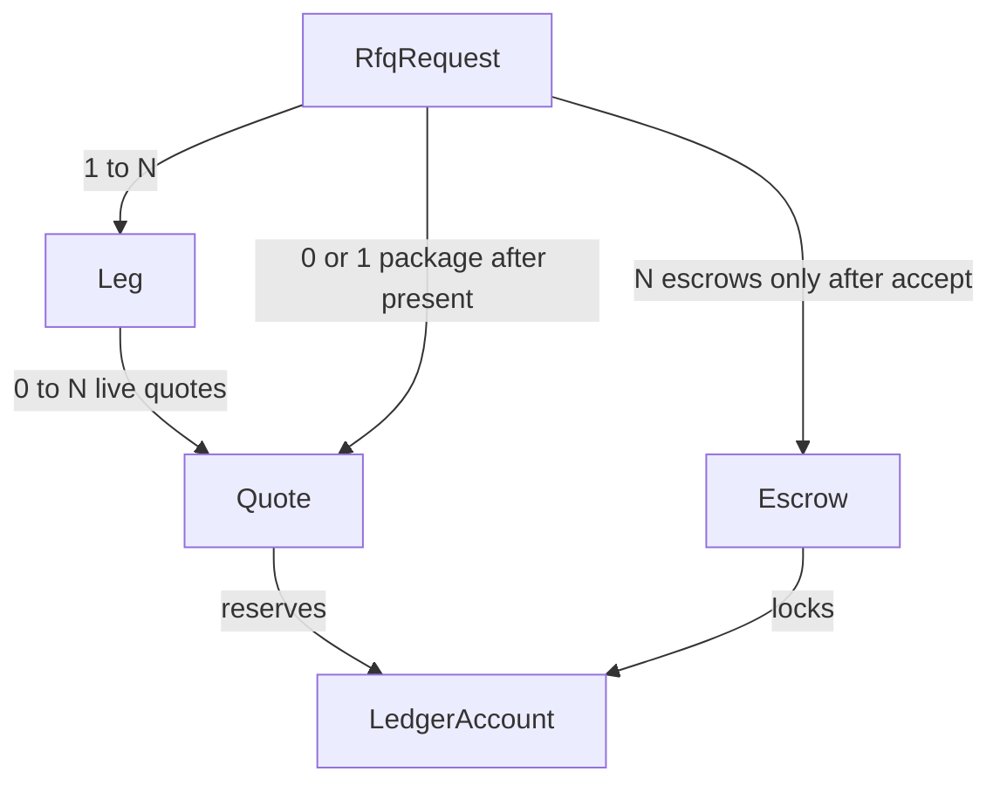
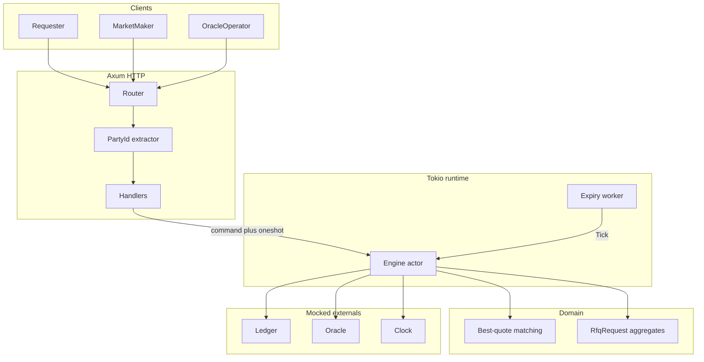
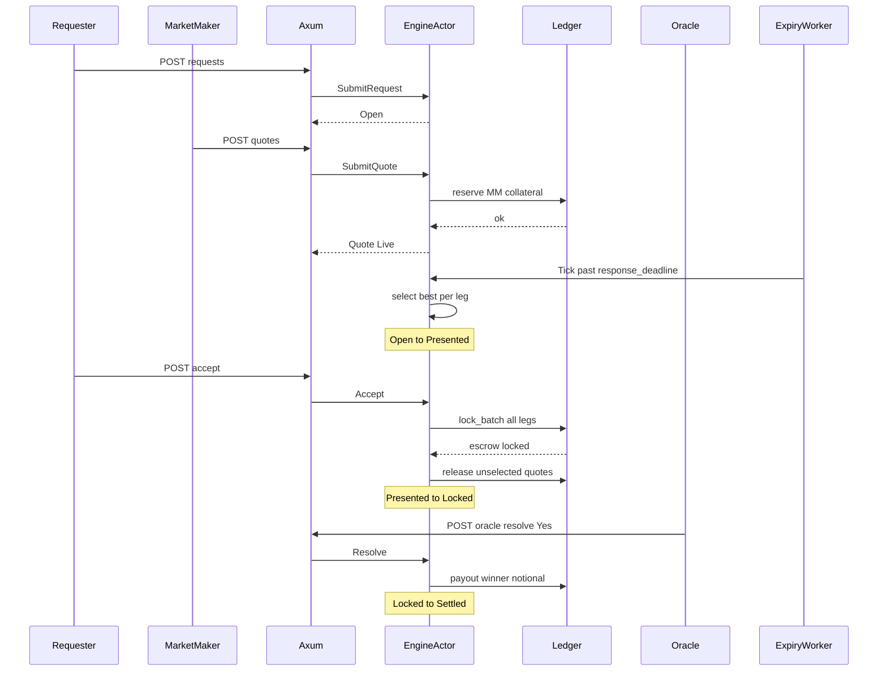
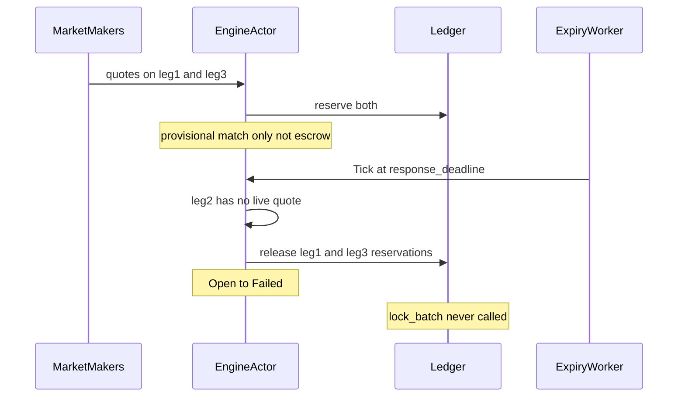
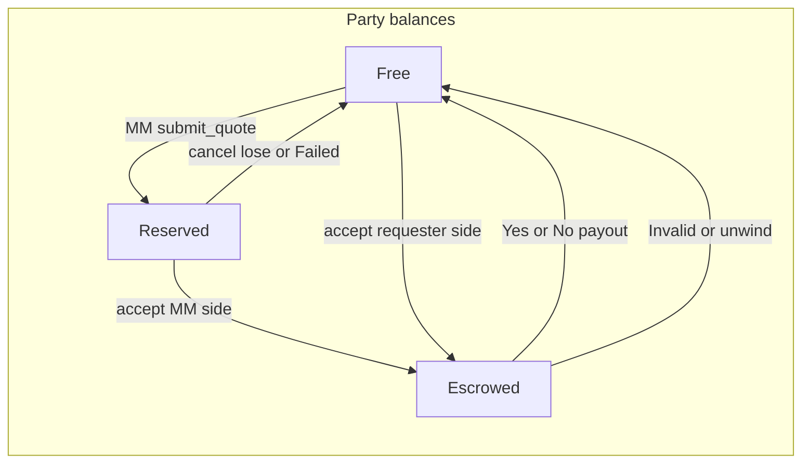
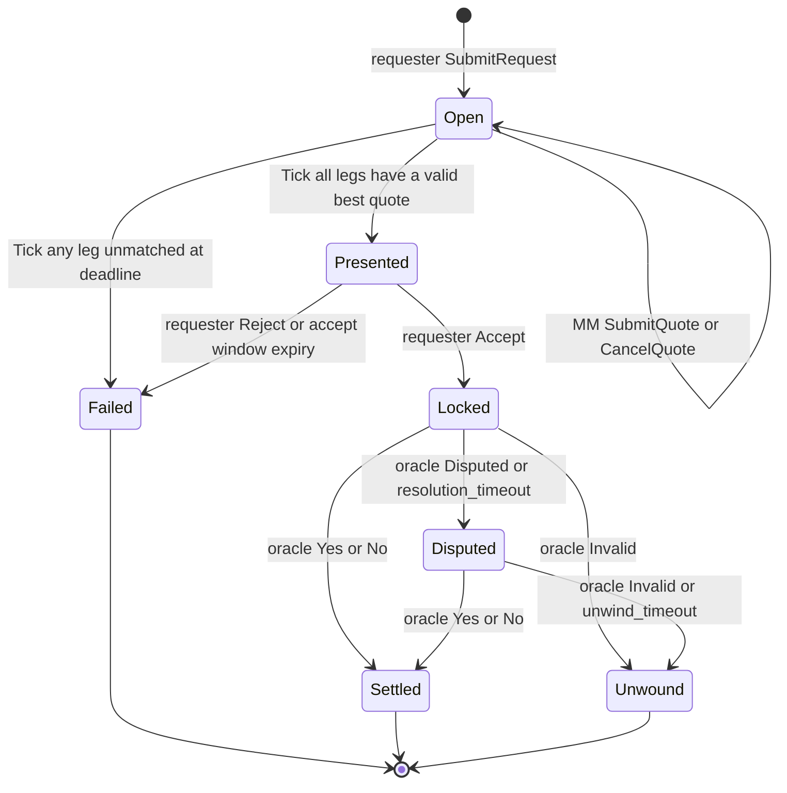
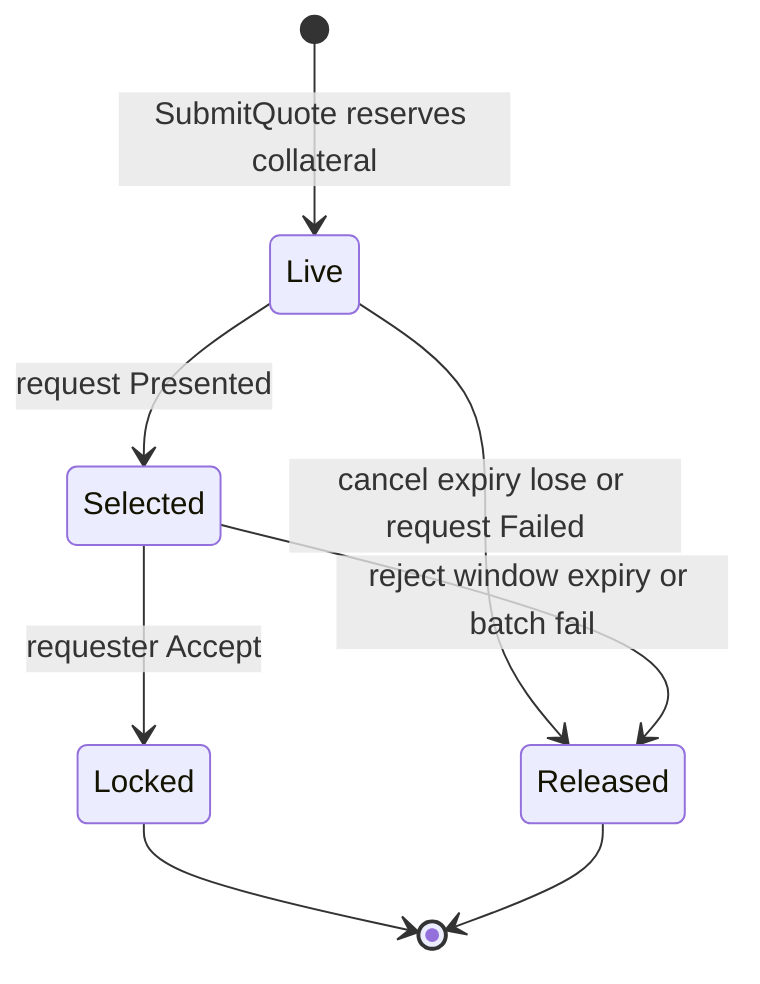

# Permissionless RFQ matching and settlement

A requester publishes a quote request (contract, notional, deadline). Market makers answer with firm quotes (price, size, their own expiry). The venue selects the best quote per leg, the requester accepts or rejects a package, both sides lock into escrow, and a mocked oracle pays the winner of a binary contract.

Pricing is not this system's problem. Capital is: every intermediate state holds real money, and every participant is adversarial.

Chain, payments, and the resolution oracle are mocked. The venue is served over Tokio and Axum. Handlers do not move funds; they send commands to an engine actor.

## Domain objects

- **Request** — aggregate root. Owns legs, quotes, deadlines, and `RequestState`.
- **Leg** — one binary contract, side (`BuyYes` / `SellYes`), and notional. Not an order.
- **Quote** — market-maker price, size, and expiry. Reserves MM collateral while `Live` or `Selected`.
- **Escrow** — exists only after accept. Yes-buyer locked `p * n`, Yes-seller locked `(1 - p) * n`, total `n`.

This is not a CLOB. There is no order book, no `Market` / `Limit` / `Stop` types, and no partial fills. Fill is atomic per request.

## Core components

- **Axum** parses JSON, extracts `x-party-id`, sends a command, maps errors to HTTP. No ledger I/O in handlers.
- **Engine actor** owns all requests and serializes mutations so accept versus expiry cannot race.
- **Matching** is a pure function: eligible live quotes with `size >= notional` and `expires_at > now`; `BuyYes` takes the lowest price, `SellYes` the highest; ties break on earlier `submitted_at`.
- **Ledger / Oracle / Clock** are traits with in-memory mocks.

### HTTP surface

Identity is claimed via `x-party-id`. Authorization is: you may only accept or reject your own request, and only cancel your own live quote.

- `POST /v1/ledger/credit` — mock faucet
- `GET /v1/ledger/{party_id}` — balances
- `POST /v1/requests` — open an RFQ
- `GET /v1/requests/{id}` — state, legs, quotes, package if presented
- `POST /v1/requests/{id}/quotes` — submit a quote (reserves collateral)
- `DELETE /v1/quotes/{id}` — cancel if still live and the request is open
- `POST /v1/requests/{id}/accept`
- `POST /v1/requests/{id}/reject`
- `POST /v1/oracle/resolve`

## Interactions

### Happy path

### Multi-leg abort: leg 2 of 3 unmatched

A provisional match is a reservation, not a lock. If any leg is unmatched at the response deadline, the whole request fails and every reservation is released. The requester is never shown a package. Escrow is request-atomic: there is no per-leg half-locked state.

## Money flow

Two buckets, never mixed:

- **Reserved** — reversible, quote-scoped. Posted when a market maker submits a quote.
- **Escrowed** — held until resolve or unwind, request-scoped. Created only on accept, all legs in one batch.

For price `p` and notional `n`: Yes-buyer locks `p * n`, Yes-seller locks `(1 - p) * n`, escrow total is `n`. The winning side receives `n`.

Where funds sit:

- **Open** — requester remains free (price unknown). Every live quote has MM collateral reserved. No escrow.
- **Presented** — selected quotes stay reserved and become firm (MM cannot cancel). Unselected quotes stay reserved until accept or fail so they cannot be double-spent into another RFQ during the window.
- **Locked** — selected MM reservation plus requester free balance move to escrow in one `lock_batch`. Losing quotes are released to free.
- **Settled** — escrow pays `n` to the winner's free balance.
- **Failed / Unwound** — every hold returns to the party that posted it. Failed after Open never creates escrow.

Conservation: for each party, `free + reserved + escrowed` equals credits minus amounts paid out to others. Venue escrowed sum equals sum of locked notionals on Locked or Disputed requests.

## Request state machine

Who may trigger each transition:

- **Open** — market makers submit or cancel their own live quotes. The expiry worker ticks quotes stale and, at `response_deadline`, either presents a package or fails the request.
- **Presented** — only the requester accepts or rejects. The worker expires the accept window. No new quotes. Selected quotes cannot be cancelled.
- **Locked / Disputed** — only the oracle resolves, or the worker applies delay policy. Parties cannot withdraw.
- **Settled / Unwound / Failed** — terminal. A second accept or reject is `409`.

### Quote lifecycle

Accepting one quote on a leg rejects competing quotes on that leg and releases the capital they reserved.

## Resolution

The engine does not interpret contract text. It accepts an oracle enum only.

- **Yes / No** — pay `n` from escrow to the winning side.
- **Unavailable / delayed** — stay Locked. After `resolution_timeout`, move to Disputed (still no payout). After `unwind_timeout`, Unwound: refund `p * n` and `(1 - p) * n`.
- **Disputed** — same hold; only a later Yes/No or unwind exits.
- **Invalid / ambiguous wording** — immediate Unwound, not a 50/50 split.

## Quote lifetime: seconds vs days

Invariant to that decision: request and quote states, who may trigger them, reservation versus escrow, best-quote comparison, binary payoff math, and request-atomic `lock_batch`.

Not invariant: how `Tick` is scheduled (in-process interval versus a durable job), whether quotes are firm at submit versus indicative-then-firm (day-long quotes make reserve-at-submit expensive), and clock-skew tolerance.

Deadlines are absolute timestamps. `Tick` carries `now`. Changing seconds to days is data and worker period, not a rewrite of Locked or Settled. A later firm-up step is a `ConfirmQuote` command before Presented.
