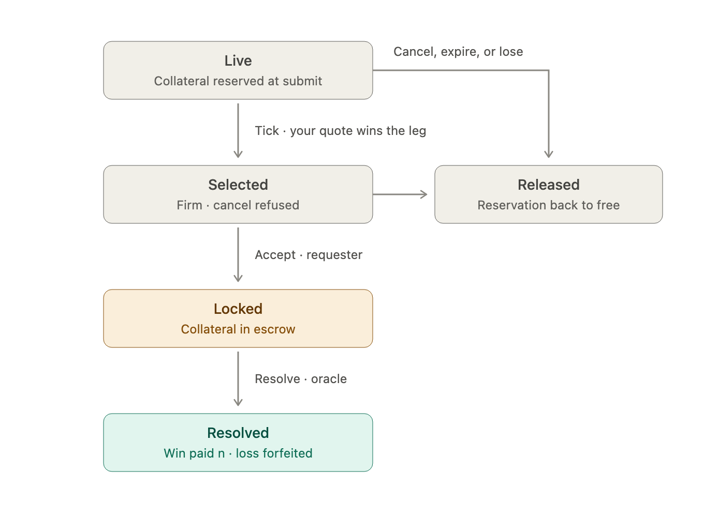

# Resolution

How escrow unlocks once a request is `Locked`, and what the engine does when the outcome is disputed, delayed, or the contract cannot be resolved as written. Rows R1–R4 and D1–D7 in `docs/FAILURE_MODES.md` pin this. The contract-text assumption this rests on is stated in `ASSUMPTIONS.md`.

## How settlement is triggered

The venue never asks anyone for an outcome. Whoever acts as the oracle pushes one:

```
POST /v1/oracle/resolve { "request_id": "...", "outcome": "yes" | "no" | "invalid" | "disputed" }
```

There is no polling and no oracle port in the code; the oracle is a caller, like the requester and the makers. The outcome is due at the request's `resolves_at` (`response_deadline + tenor`, the same instant for every leg), and the expected rule is strike-based: `yes` if the instrument's price at that instant is above the strike named in the description, `no` otherwise. If nobody posts, the request stays `Locked` and escrow stays held (see "Delayed").

The body does not say whom to pay. It says what happened, and the engine derives the payee from what it recorded at accept: each leg's escrow names a Yes-buyer and a Yes-seller, fixed by the leg's side (`buy_yes` / `sell_no` make the requester the Yes-buyer, `sell_yes` / `buy_no` make the maker the Yes-buyer). The caller cannot name a payee, choose an amount, or resolve one leg differently from another: one outcome applies to every leg of the request. The only lever is the outcome itself, and who may pull it is the authorization question `ASSUMPTIONS.md` places out of scope.

Money ends in the winner's `free` balance, readable at `GET /v1/ledger/{party_id}`. There is no withdrawal step because real money movement is out of scope.

## What is locked

By `Locked`, reservations are gone: accept converted every selected quote's reservation into escrow in one `lock_batch` and released every loser. Each leg holds two ledger handles, one per poster: the Yes-buyer's `p * n` (floored) and the Yes-seller's `n - p * n`. They sum to exactly `n`, so a leg's pool is its notional. A multi-leg request holds one pool per leg; one `Resolve` acts on all of them with the same outcome.

## Unlock mechanics



`POST /v1/oracle/resolve { request_id, outcome }` runs on the engine actor, serialized with every other command. The request must be `Locked` or `Disputed`; anything else is `409` with no ledger call.

| Outcome | From `Locked` | From `Disputed` |
|---|---|---|
| `yes` / `no` | `Reported`: outcome and `dispute_deadline = now + dispute_window` recorded, no ledger call | `Settled`: both chunks of every leg paid to that leg's winner, immediately and once |
| `invalid` | `Unwound`: each chunk refunded to its poster | same |
| `disputed` | `Disputed` with `unwind_deadline = now + unwind_timeout`, no ledger call | no-op, `200` |

A resolve while `Reported` is `409`: a report is not overwritten, it is disputed. `payout` moves a chunk from the poster's `escrowed` to the winner's `free`, so a Yes-buyer who put up `p * n` walks away with `n`. `refund` moves each chunk back to its poster's `free`. Handles are consumed either way, and money moves exactly once per leg, on the transition into `Settled` or `Unwound`.

## Disputed: delayed finality

A `yes` / `no` report does not pay out. It opens a window of `dispute_window` (60 s by default) during which the requester, or any maker whose quote is locked in the request, may `POST /v1/requests/{id}/dispute`. Anyone else is `403`; filing while the request is not `Reported` is `409`; filing twice is `409`.

- **Nobody files.** The first `Tick` with `now > dispute_deadline` settles the reported outcome. Filing at the deadline instant itself is still allowed, matching the accept-window convention.
- **A party files.** The request becomes `Disputed` with `unwind_deadline = now + unwind_timeout` (1 day by default). Nothing moves. The old dispute window no longer settles it.
- **Adjudication.** Whoever posts the final outcome on the resolve endpoint decides: `yes` / `no` settles, `invalid` unwinds, both immediately and once. A repeated `disputed` is a no-op.
- **No adjudication.** The first `Tick` with `now > unwind_deadline` refunds each poster its own chunk: `Unwound`, terminal.

Settlement is never reversed. A paid chunk is the winner's to reserve elsewhere in the very next command, so a clawback could fail or reach into live reservations; delaying finality avoids that class entirely. The oracle may also post `disputed` directly from `Locked`; it behaves exactly like a party's filing.

**What it costs.** Filing is free, so a losing party can always delay the winner by up to `unwind_timeout`, and if no adjudication arrives the loser is refunded rather than paid out. The remedy is a dispute bond forfeited to the winner when the report is upheld; it is money-state, in scope, and a separate step.

## Delayed

"Delayed" means nobody has called resolve. Resolution is push-only: the engine does not poll anything, so a contract nobody has resolved is indistinguishable from one that never will be. The request sits in `Locked`; `Tick` skips `Locked`, so escrow is held indefinitely. Nothing leaks in the accounting sense, but capital is stuck until an outcome arrives.

The intended policy, **not implemented**: after `resolution_timeout` past `resolves_at` with no report, `Locked → Disputed`, from where the existing `unwind_timeout` refunds everyone. One more `EngineConfig` field and one more `Tick` arm; `resolves_at` is already recorded.

## Contract text and `invalid`

Contract text is never something the venue interprets or adjudicates. A leg's `ContractDescription` must be a complete resolution rule: a measurable condition, the data source, the UTC instant it is read, and the `No` branch (`ASSUMPTIONS.md`, "contract descriptions are complete resolution rules"). The engine stores it verbatim, validates only that it is non-blank and at most 1000 characters, and treats `ContractId` and `ContractDescription` as opaque. Unclear text is the requester's cost at the time of writing, not a case the resolution design handles.

`invalid` therefore means one thing: the contract cannot be resolved as written, because the source no longer exists, the event was cancelled, or the reading is permanently unavailable. It unwinds immediately and each poster gets its own chunk back. Deliberately it is not a 50/50 split, which would transfer money on a contract that will never settle, and not a dispute, which is a contested but obtainable reading and keeps the request alive. `invalid` from `Disputed` behaves the same.

## Invariants

- Escrow is created only by accept and destroyed only by `payout` or `refund`.
- Per leg, `yes_buyer_amount + yes_seller_amount == notional`; a `yes` / `no` winner receives exactly `notional`.
- A request settles or unwinds at most once; `Reported` and `Disputed` never move money.
- Venue-wide, escrowed equals the notionals of `Locked`, `Reported`, and `Disputed` requests.
